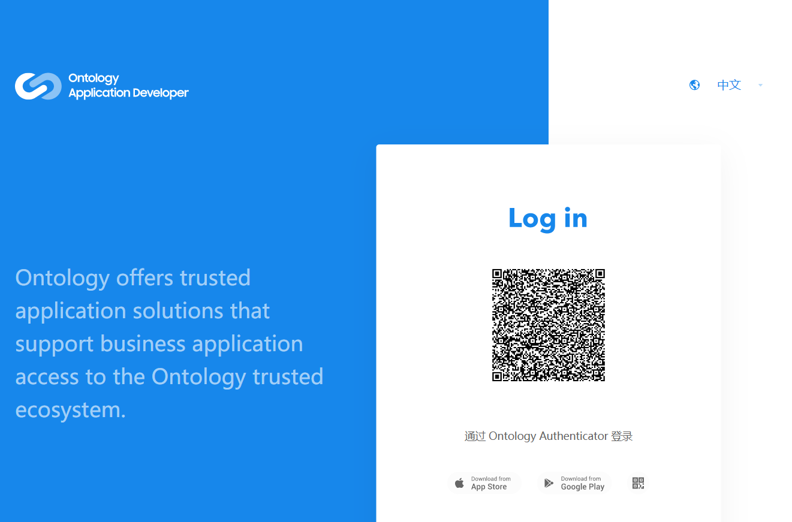
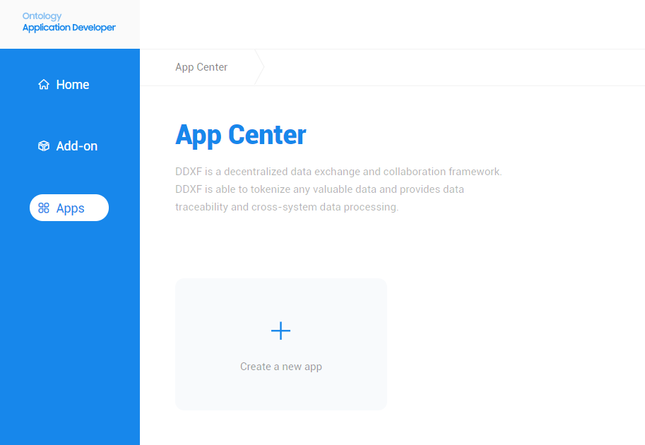
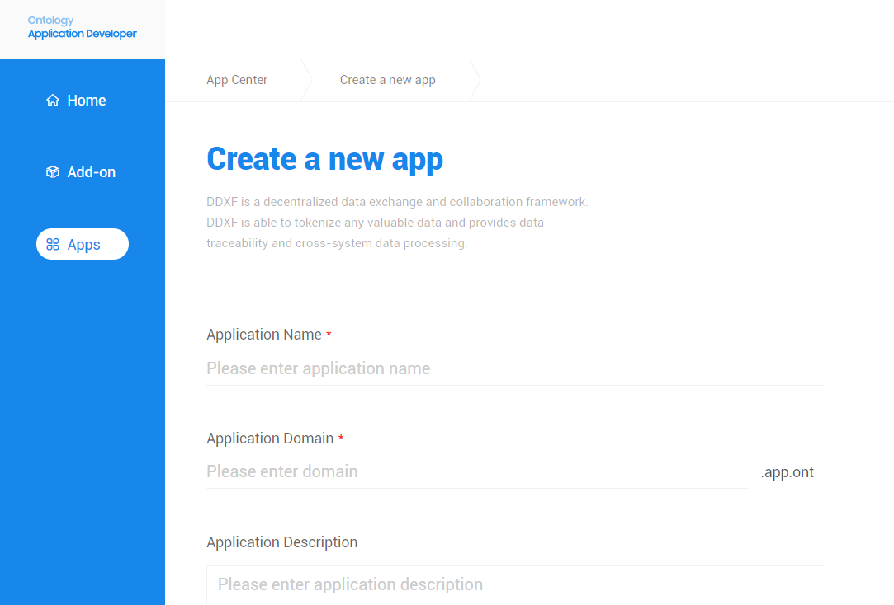
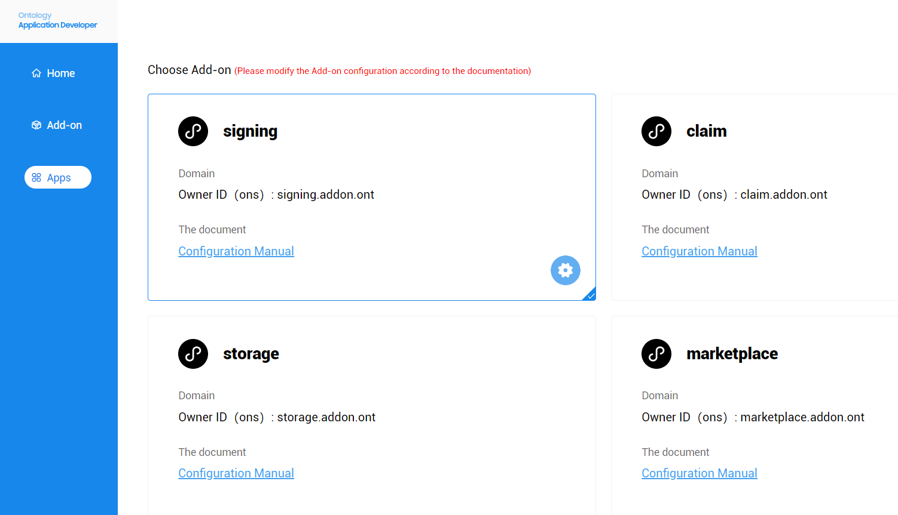
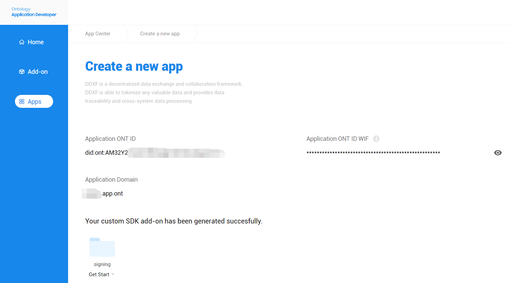
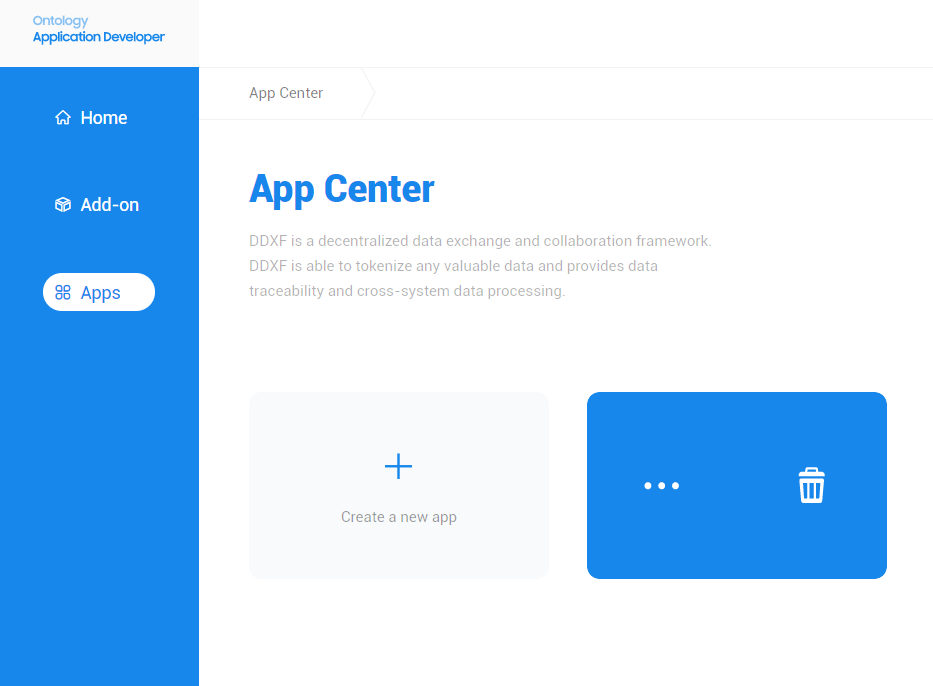

# Instruction

## Get Start

1.下载OntAuth(Ontology Authenticator) 签名机并注册ONT ID
https://authenticator.ont.io/

2.注册账号并登录Addon Store
https://store.dev.ont.io/login


3.创建应用


3.1.输入应用信息


3.2.选择addon，编辑相关配置（也可以在第5步编辑）


4.创建完成，可查看app对应的domain，ONT ID和私钥（wif），及下载选择的SDK


5.查看app详细及修改配置


signing-addon配置说明：
```json
{
  "payerAddress": "AcdBfqe7SG8xn4wfGrtUbbBDxw2x1e8UKm",
  "payerPrivateKey": "",
  "actions": [
    {
      "action": "register",
      "type": "ontid",
      "onchainRec": false,
      "dataUrl": "",
      "callbackUrl": "",
      "mainNet": false
    },
    {
      "action": "login",
      "type": "ontid",
      "onchainRec": false,
      "dataUrl": "http://data-url",
      "callbackUrl": "http://callback-url",
      "mainNet": false
    }
  ]
}
```

| Field_Name | Type   | Description                   |
|:-----------|:-------|:------------------------------|
| payerAddress     | String | 手续费付款钱包地址                      |
| payerPrivateKey    | String | 钱包私钥                        |
| actions       | List    | 动作集合                        |
| action        | String | 注册的动作名称 |
| type     | String | 签名的账户类型：``ontid``或``address``     |
| onchainRec        | boolean | 是否上链动作 |
| dataUrl        | String | OntAuth获取交易参数的接口地址(需定义为Get请求) |
| callbackUrl        | String | signing-server需要回调告知app验签结果的接口地址(需定义为Post请求) |
| mainNet        | boolean | 验签成功返回"1",验签失败"0",未验签返回null |

````
dataUrl:
调用signing-server"验证并获取二维码参数"接口时，会传入app方的id，signing-server会将id拼接在dataUrl后面，
形成"http://data-url/{id}"格式返回给OntAuth，OntAuth向"http://data-url/{id}"发送Get请求，获取交易参数
````

````
callbackUrl:
signing-server的回调请求参数详见： https://github.com/ont-bizsuite/signing-addon/blob/master/documentation/Signing-server-Restful-api.md
````

6.使用SDK开发应用：
```
https://github.com/ont-bizsuite/signing-sdk-java
```